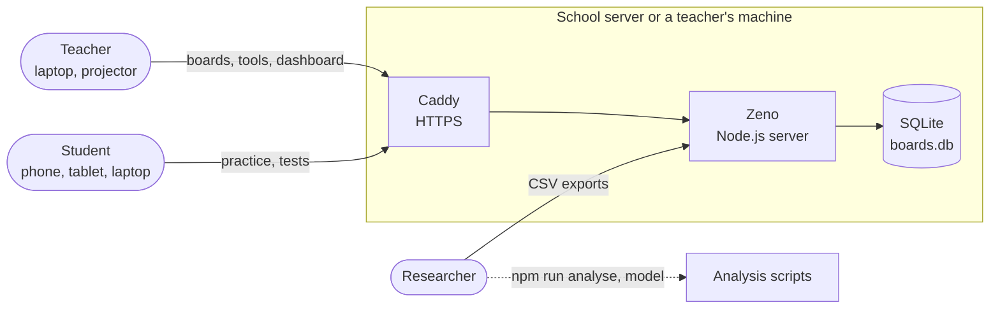
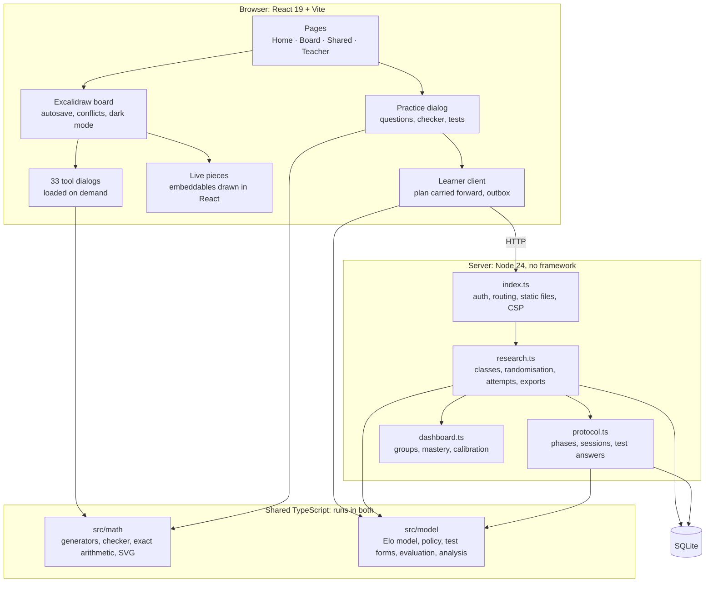
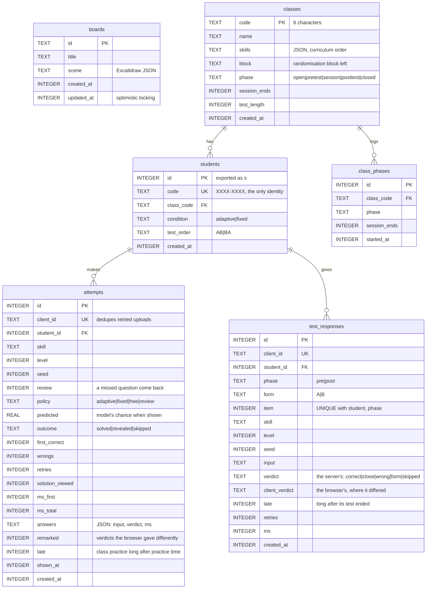
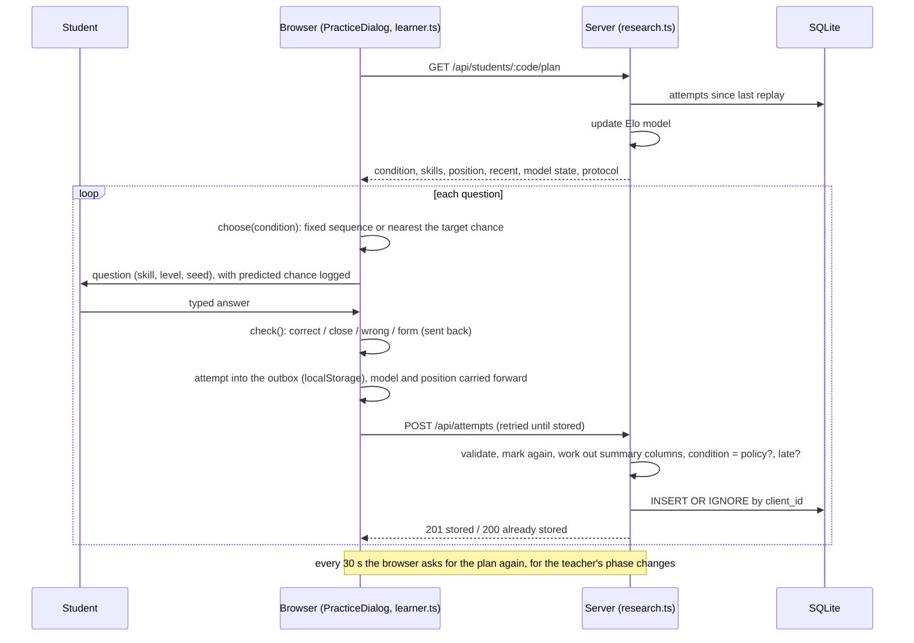
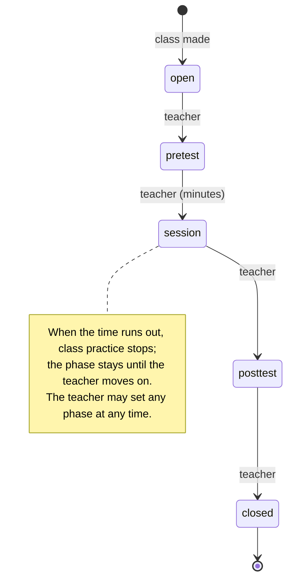

# Architecture

Zeno is a self-hosted maths whiteboard with a class-study layer for one research question: **does choosing
practice questions with a learner model (adaptive) help students learn more than a fixed sequence?** This page
describes how it is built and why. The HTTP routes are in [api.md](api.md).

## System context

**Self-hosted, nothing from outside.** A school can run Zeno on one machine, with one Docker container and one
database file, and no data leaves it. The page loads nothing from a CDN: fonts, MathJax and every library are
bundled. The one optional exception is the Excalidraw library browser. Students have no accounts: a student is a
code they write down, and the exports name them `s1`, `s2`, ….

## Building blocks

**The same model code runs in the browser and on the server.** `src/model` has no browser or Node dependencies, so
the server keeps the learner model up to date from stored attempts, and a student's browser carries it forward
question by question. Class practice therefore keeps working when the classroom Wi-Fi drops. The server checks that
a class-practice question was chosen by the student's own condition, marks every answer again with the same checker
(`server/marking.ts`; the Docker image runs it as one bundled file, since it needs mathjs and MathJax), and notes
answers that arrive long after their phase.

**Questions are made from a seed.** Every question is generated from (skill, level, seed), so an attempt or a test
answer stores only those three numbers and what was typed. That means:

- the exact question can be rebuilt for analysis;
- test forms follow from the class code, with no storage, and the server can tell which question an answer was for;
- answers can be marked again later with an improved checker.

## Data model

Deleting a student deletes their attempts and test answers (`ON DELETE CASCADE`). The learner model is not stored:
the server replays the attempts the first time it is asked, then keeps it in memory and adds new attempts as they
arrive. It replays everything again after a deletion. Columns added after the first version are added on start by
`initResearch` / `initProtocol`, so an old database is upgraded in place.

## A practice question, end to end

## The study protocol

Students join in randomised blocks of four (two per condition), so a class never drifts more than two apart. Within
each condition, students alternate between taking form A first and form B first. Test answers never reach the learner
model, so the outcome measure is independent of what the adaptive condition learns from.

## Design decisions

| Decision | Why | Cost |
|---|---|---|
| Elo-style ratings with three ability layers, not BKT or deep knowledge tracing | Learns online from the first answer, needs no training data, cheap enough for a phone, explainable to a teacher, and works for skills a student hasn't tried yet (through its area). On held-out students it beats PFA and BKT on simulated data; see `npm run model` for real data. | Assumes one difficulty per skill and level; no forgetting. |
| Questions chosen and marked in the browser, marked again on the server | Practice survives dropped connections, and the student sees a verdict at once; the stored verdict is the server's. | A modified client could pick its own questions, but only within its own condition. The server needs the checker's dependencies, so the image carries it as one bundled file. |
| Questions generated from seeds | Reproducible forms and analyses, re-scoring, tiny storage. | Generators must never change what a seed means once a study has started. |
| Codes instead of accounts | No personal data; children can join with a code on paper. | A lost code can't be recovered; anyone with the code can delete the record. |
| SQLite in one file, Node without a framework | One container, no database server, easy backup; few dependencies to audit. | One server process; no horizontal scaling (a school doesn't need it). |
| Phases judged by when an answer arrives, with five minutes' grace, against a log of the teacher's changes | The browser hears of a change only every 30 s and keeps answers while offline; an answer that comes late is kept and marked, not lost. | Late answers are the analysis's to report; a test not yet started is refused outright. |
| Optimistic locking for boards (`baseUpdatedAt`, 409) rather than real-time collaboration | Simple and safe: no edit is silently lost. | Two people editing one board take turns rather than seeing each other live. |
| The analysis written before the data (`src/model/analysis.ts`) and rehearsed on simulated classes | Guards against choosing the analysis after seeing the results. | — |

## Quality

**Tests.** `npm test` uses Node's built-in test runner, with no test framework. It covers:

- the maths engine against independent computations;
- every tool example in three languages;
- the HTTP API, including this page's route table;
- the study rules;
- the learner model and its baselines;
- the analysis against hand-worked values;
- the answer checker against teacher marking;
- a dry run of the whole study through the real server.

CI runs on every push:

- the typecheck;
- ESLint;
- the tests, with coverage thresholds for `src/math` and `src/model`;
- the build;
- Playwright end-to-end tests of a board and of the class study in Chromium;
- a Docker build and smoke test.

**Data safety.** A daily `VACUUM INTO` copy of the database goes to `DATA_DIR/backups/`, keeping seven. The schema
version is recorded in `PRAGMA user_version`, and a database from a newer Zeno is refused.

**Security.**

- An optional site password, and a teacher password, both compared in constant time.
- Brute-force protection: 10 wrong passwords in 10 minutes and that client waits, with 429. Behind a proxy
  (`TRUST_PROXY`), the client is the address the proxy adds last to `X-Forwarded-For`.
- JSON-only request bodies, so a cross-site form can't post, with size limits.
- A strict Content-Security-Policy with no inline scripts, plus `nosniff`, `X-Frame-Options` and `Referrer-Policy`.
- Path-traversal checks on static files.
- Exports that never contain sign-in codes, and that can't inject spreadsheet formulas.

HTTPS comes from a reverse proxy (Caddy).

**Performance.**

- Every tool dialog, the live graph (mathjs) and each language load on demand.
- Built files are precompressed (brotli and gzip) and served with immutable caching.
- The server keeps the learner model in memory, adding new attempts as they come, rather than replaying them on every request.
